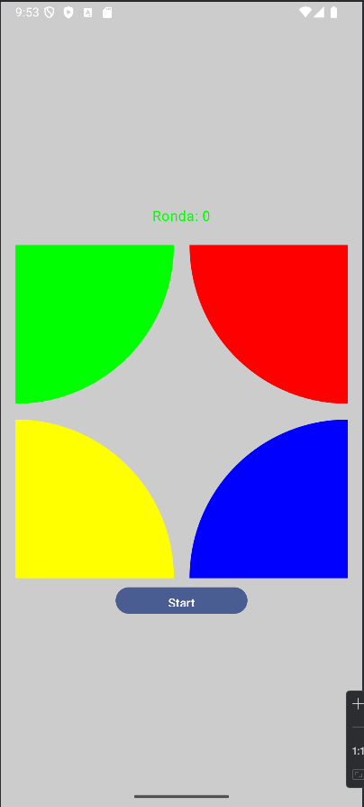
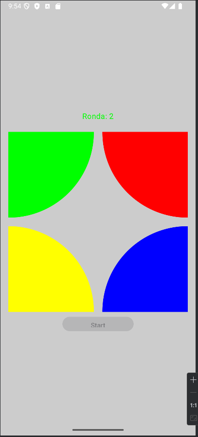
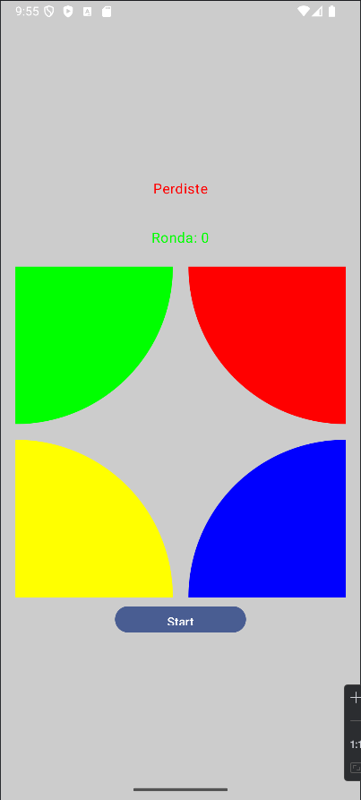

# Simon Dice - Juego con Arquitectura MVVM

Este proyecto es una implementación del juego "Simon Dice", desarrollado en Kotlin utilizando **Jetpack Compose** para la interfaz de usuario. Sigue el patrón de diseño **MVVM (Model-View-ViewModel)** para garantizar una separación clara de responsabilidades y una arquitectura escalable. Además, hace uso de **corutinas** para manejar operaciones asincrónicas, garantizando una experiencia fluida.

---
## Contenido

1. [🛠️ **Arquitectura MVVM**](#arquitectura-mvvm)
    - **Modelo**
    - **Vista**
    - **ViewModel**
2. [📜 **Estructura del Código**](#estructura-del-código)
    - **Modelo**
    - **Vista**
    - **ViewModel**
3. [🚀 **Tecnologías Utilizadas**](#tecnologías-utilizadas)
    - **Kotlin**
    - **Jetpack Compose**
    - **LiveData**
    - **Corutinas**
    - **MVVM**
4. [💡 **Puntos Clave**](#puntos-clave)
    - **Corutinas en Jetpack Compose y ViewModel**
    - **Separación de Responsabilidades**
    - **Documentación del Código**
5. [🕹️ **Cómo Jugar**](#cómo-jugar)
6. [📚 **Próximas Mejoras**](#próximas-mejoras)
7. [🎨 ** Capturas del **](#próximas-mejoras)

  
<h2><b>🛠️ Arquitectura MVVM</b></h2>

El proyecto está estructurado en tres componentes principales, según el patrón MVVM:

### **Modelo (Model)**
- El modelo se encarga de almacenar y gestionar los datos del juego.
- Contiene:
    - **Datos:**
        - Variables observables como la ronda, gestionadas con `MutableLiveData`.
        - Enumeraciones para definir colores y estados del juego.
    - **ButtonData:** Clase que estructura la información de cada botón (color y forma).

### **Vista (View)**
- La interfaz de usuario se encuentra en la función composable `IU`.
- Controles principales:
    - Botones de colores interactivos con cambios visuales dinámicos.
    - Un botón para iniciar o reiniciar el juego.
- La vista observa cambios de estado a través de **LiveData** y responde de manera reactiva.

### **ViewModel**
- El **ViewModel** actúa como intermediario entre la vista y el modelo.
- Gestiona el estado del juego (`Estados`) y la lógica de la secuencia de colores.
- Se utiliza `viewModelScope` para manejar operaciones asincrónicas con **corutinas** como:
    - Mostrar la secuencia de colores al usuario.
    - Asegurar intervalos entre las animaciones y transiciones de estado.

---

  
<h2><b>📜 Estructura del Código</b></h2>

### **Modelo**
1. **`Datos`**: Contiene variables globales como la ronda (`MutableLiveData`) y el número base.
2. **`ColorButton`**: Enum que define los colores del juego, asociados a valores únicos.
3. **`ButtonData`**: Clase para estructurar datos relacionados con los botones.
4. **`Estados`**: Enum que define los posibles estados del juego:
    - `INICIO`: El juego está en la pantalla inicial.
    - `GENERANDO`: La secuencia de colores se está mostrando.
    - `ADIVINANDO`: El jugador intenta repetir la secuencia.
    - `PERDIDO`: El jugador ha fallado.

### **Vista**
- Composables principales:
    - **`IU`**: Gestiona la estructura general de la interfaz.
    - **`Boton_Start`**: Botón para iniciar o reiniciar el juego.
    - **`Botones`**: Representa los botones de colores, actualizados dinámicamente según el estado del juego.
- Usa **`observeAsState`** para responder a cambios en el `LiveData` del ViewModel.

### **ViewModel**
1. **`empezarJugar()`**: Inicia el juego limpiando la secuencia y añadiendo un color inicial.
2. **`mostrarSecuencia()`**: Utiliza **corutinas** para mostrar la secuencia de colores con un intervalo de tiempo.
3. **`compararColorSeleccionado(colorSeleccionado)`**: Verifica si el color seleccionado es correcto y avanza en la secuencia o termina el juego.
4. **`agregarColorASecuencia()`**: Añade un color aleatorio a la secuencia y actualiza el estado de la ronda.

---

<h2><b>🚀 Tecnologías Utilizadas</b></h2>

- **Kotlin**: Lenguaje principal del proyecto.
- **Jetpack Compose**: Para la creación de la interfaz de usuario declarativa.
- **LiveData**: Para la observación de datos reactivos.
- **Corutinas**: Para manejar tareas asincrónicas dentro del ViewModel.
- **MVVM**: Arquitectura de diseño para una separación clara de responsabilidades.

---

  
<h2><b>💡 Puntos Clave</b></h2>

## 💡 ****

1. **Corutinas en Jetpack Compose y ViewModel**:
    - Se utiliza `viewModelScope.launch` para manejar animaciones asincrónicas y cambios de estado fluidos.
    - `delay` permite pausar entre las animaciones de colores para simular el parpadeo.

2. **Separación de Responsabilidades**:
    - Las funciones de lógica de juego y manipulación de datos residen completamente en el ViewModel.
    - La vista es responsable únicamente de mostrar los datos y reaccionar a los eventos emitidos desde el ViewModel.

3. **Documentación del Código**:
    - Cada clase, función y componente está claramente comentado.
    - Los comentarios explican el propósito y funcionamiento de cada sección.

---

  
<h2><b>🕹️ Como Jugar</b></h2>

1. Presiona el botón "Start" para iniciar el juego.
2. Observa la secuencia de colores generada automáticamente.
3. Repite la secuencia presionando los botones en el orden correcto.
4. Si fallas, el juego termina y puedes reiniciarlo.

---

  
<h2><b>📚 Próximas Mejoras</b></h2>

- Agregar niveles de dificultad con secuencias más largas.
- Incluir sonidos asociados a cada color para mejorar la experiencia del usuario.
- Guardar el puntaje más alto en memoria persistente.

---
## 🎨 **Capturas del Juego**

1. **Pantalla de Inicio**  
   

2. **Juego en Progreso**  
   

3. **Pantalla de Perdido**  
   